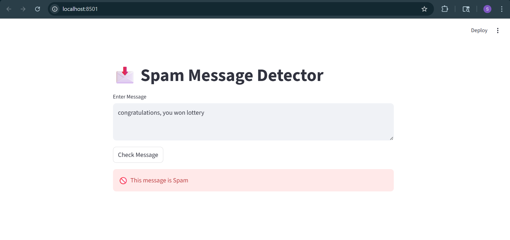

# Spam Detection App

This is a Machine Learning web application that detects whether a message is Spam or Not Spam using Naive Bayes Algorithm.

## Technologies Used
- Python
- Streamlit
- Scikit-learn
- Pandas

## Features
- Real-time spam detection
- User-friendly interface
- Machine Learning based prediction
## Output Screenshot

